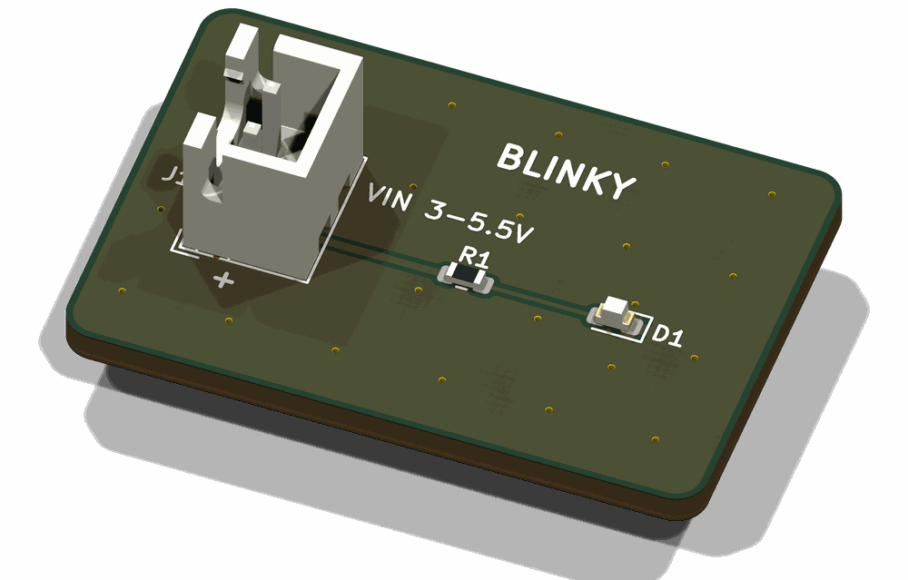

# pcbkit

pcbkit designs, places, routes, checks and exports KiCad boards from Python. A board is a
small project of plain Python modules and one `pcbkit.toml`. The schematic, the placement,
the routed copper, the fab files and a suite of design checks are all generated from it,
so a change to a board is a code change that you can review, rebuild and check.



Documentation: <https://bruk-io.github.io/pcbkit/>

Version 0.1.0. It is built and tested on macOS with KiCad 10.0.6. It makes two-layer
boards, routes them with Freerouting, and knows PCBWay's limits and order forms.

## Two tiers

KiCad's `pcbnew` Python module only imports under the Python that ships inside KiCad (3.9
in KiCad 10 on macOS), not under whichever Python you installed pcbkit with. So pcbkit's
commands come in two tiers:

- **Tier 1** needs no `pcbnew`, so it runs anywhere pcbkit is installed, `uvx` included:
  `new`, `doctor`, `setup`, `sch`, `report`, `quote` and `shots`. (`sch` and `shots` still
  call `kicad-cli`.)
- **Tier 2** imports `pcbnew`: `build`, `route`, `promote`, `finalize`, `check`, `mutants`
  and `compare`. It runs in the board project's own `.venv`, which `pcbkit setup` builds on
  KiCad's Python with pcbkit installed in it. You run these as `.venv/bin/pcbkit <command>`;
  anywhere else they stop and tell you to run `pcbkit setup`.

## Quickstart

You need KiCad 10, Java 17 or newer, ngspice, librsvg (for `rsvg-convert`) and
[uv](https://docs.astral.sh/uv/). On a Mac with Homebrew, the Brewfile in this repository
installs all of them:

```
brew bundle --file=Brewfile
```

Without a checkout, `brew install --cask kicad` and then
`brew install openjdk@21 ngspice librsvg uv` do the same.

Then make a board from the blinky template, set it up, and run the whole pipeline:

```
pcbkit new my-board           # a board project, copied from the blinky example
cd my-board
pcbkit setup                  # .venv on KiCad's Python, and the Freerouting jar
.venv/bin/pcbkit doctor       # is everything there?
.venv/bin/pcbkit build        # schematic, ERC, netlist, placement
.venv/bin/pcbkit route        # Freerouting, ground pours, DRC
.venv/bin/pcbkit promote      # keep the route that passed as golden/
.venv/bin/pcbkit finalize     # rebuild from golden/, DRC, Gerbers, BOM, renders
.venv/bin/pcbkit check        # the design checks
```

`pcbkit new` and `pcbkit setup` run before the project has a `.venv`, so how you type them
depends on where pcbkit is: see the next section. The finished board is in `kicad/`, and
what you send to a fab house is in `out/fab/`. The
[getting started guide](docs/getting-started.md) goes through each step, then changes a
part and rebuilds.

## Running pcbkit

**From GitHub**, once the repository is public:

```
uvx --from git+https://github.com/bruk-io/pcbkit pcbkit new my-board
cd my-board
uvx --from git+https://github.com/bruk-io/pcbkit pcbkit setup
```

**From a local checkout**, before the repository is public or when you are working on
pcbkit itself (adjust `~/src/pcbkit` to where it is):

```
uv run --project ~/src/pcbkit pcbkit new my-board --pcbkit-source ~/src/pcbkit
cd my-board
uv run --project ~/src/pcbkit pcbkit setup
```

`--pcbkit-source` (or the `PCBKIT_SOURCE` variable) makes the new project install pcbkit
from that folder. Without it the project's `pyproject.toml` names the git repository, which
`setup` cannot fetch until it is public.

To type less, `uv tool install --from ~/src/pcbkit pcbkit` (or
`uv tool install git+https://github.com/bruk-io/pcbkit`) puts a `pcbkit` command on your
`PATH`. After `setup`, everything is `.venv/bin/pcbkit ...`.

## The Claude Code plugin

This repository is also a Claude Code plugin. It has skills for starting a board, running
the build loop, adding a check, reviewing a layout and ordering from PCBWay; two helper
agents; and hooks that stop edits to the generated folders. Once it is published to the
knowhere marketplace:

```
claude plugin marketplace add bruk-io/knowhere
claude plugin install pcbkit@knowhere
```

Until then, `claude --plugin-dir ~/src/pcbkit` loads it from a checkout for one session.
[docs/claude-plugin.md](docs/claude-plugin.md) says what each piece does and what the hooks
cannot see.

## Documentation

<https://bruk-io.github.io/pcbkit/> has the getting started guide, the concepts, the board
project interface (the contract for every file in a board folder), routing recipes, how to
write checks, ordering from PCBWay, troubleshooting and the command reference. The pages
are in [docs/](docs/).

## Working on pcbkit

`uv sync`, then `uv run pytest tests/unit -q`. [.claude/CLAUDE.md](.claude/CLAUDE.md) has
the rest: the two test environments, the Python 3.9 floor, and what to know about pcbnew.

## Licence

pcbkit is licensed under the GNU Affero General Public License, version 3 or (at your
option) any later version (AGPL-3.0-or-later). See [LICENSE](LICENSE).

Some employers restrict or forbid the use of AGPL-licensed software. If you work for one,
check its policy before you use pcbkit at work. This is not legal advice.
